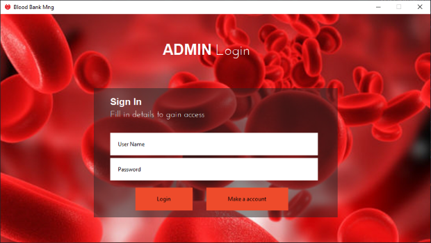
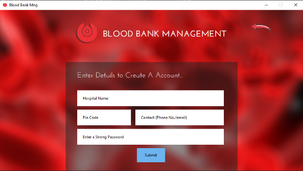
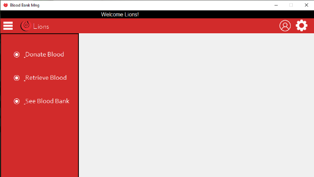
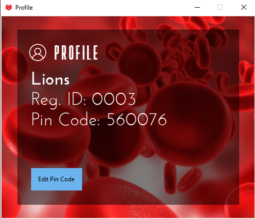

# A tkinter project
School project for a Blood Bank Management System, backed with functioning database system and features
###### NOTE:    THIS IS NOT A PUBLIC PACKAGE

# Dependencies 
- Tkinter @ Python `3.11`
- MySQL w/Python, `v8.0.33`
- OS dependant modules

Built to work on windows, should work on linux.

## Running this
Install Python **3.7 or newer**, along with MySQL and `mysql-connector-python`
Update `MYSQL_PASSWORD` variable in `functions.py` (in `__main__` for v3) to your sql password

Clone the project
```bash
git clone https://github.com/UnKnownnPasta/school-project-BBSQL.git
```

# Functionality [^1]
User friendly Login/Sign up page
Admin/User independent pages
* Admin:
    - View all active blood donations
    - Retrieve blood types and their stored units
    - Modify/Append to blood bank database
    - Retrieve blood for transfusion
* User:
    - Register as donator or recipient
    - Donate/Recieve blood
    - Detailed view of profile

# 🖼 Gallery
### Login screen:


### Sign up screen:


### Admin Landing Page: [^2]


### Editing Profile:



[^1]: This project is subject to have drastic changes in code and looks, it's never finalised. why is this a note? why not
[^2]: Still in process of being made